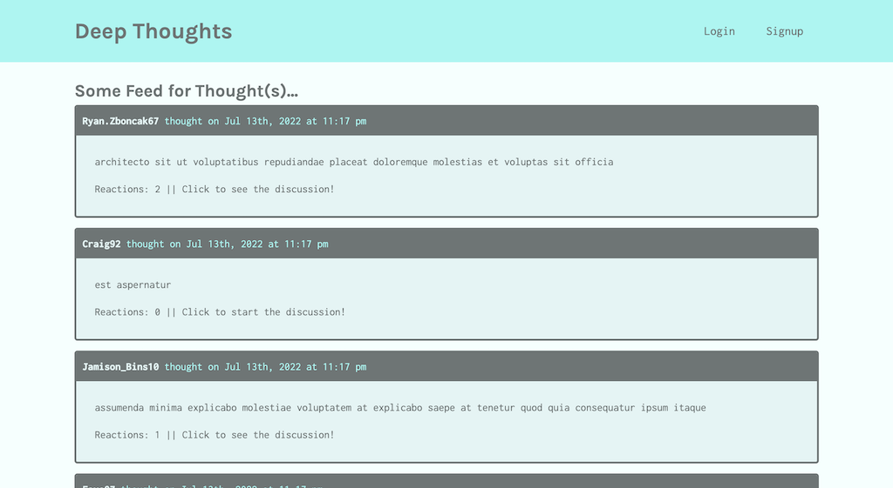

# Deep-Thoughts 

## Description 
This project is a full stack web application using the MERN Stack along with GraphQL and Apollo. This is a blogging platform that will allow users to sign up and login, view profile pages, add friends, add reactions, and add thoughts. This application uses JWT for authentication and is deployed on Heroku.

## Table of Contents
* [Installation](#installation)
* [Usage](#usage)

## Installation 
The user should clone the repository from GitHub and install dependencies. For development or testing purposes, run `npm install` on both client and server directories to install dependencies. There are two servers for client side and server side, which can be run on their own. To run both servers at the same time, open the root directory and run `npm start`.

## Usage 
This application will allow users view an about me page, send information through a contact form, view my projects, and view my resume. 
Please view deployed application on [Heroku](https://ah-deep-thoughts.herokuapp.com/) 

